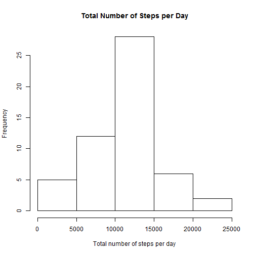
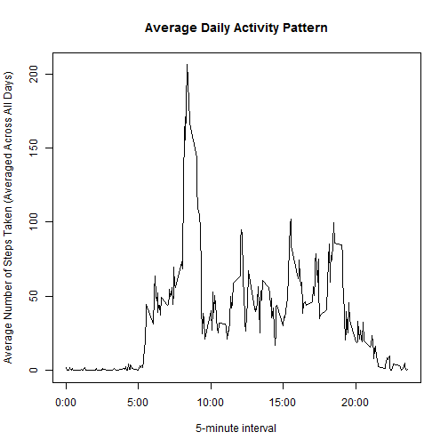
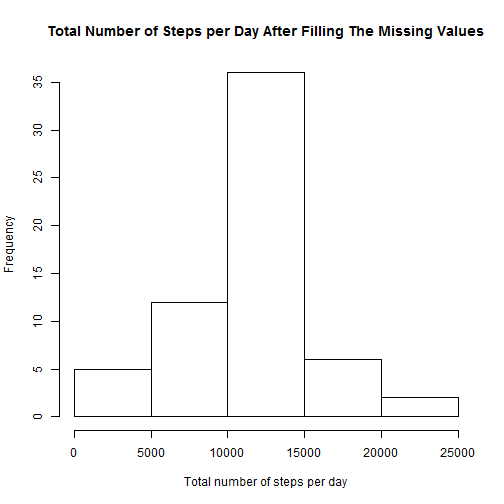

# Reproducible Research: Peer Assessment 1
 

## Introduction
It is now possible to collect a large amount of data about personal movement using activity monitoring devices such as a Fitbit, Nike Fuelband, or Jawbone Up. These type of devices are part of the "quantified self" movement - a group of enthusiasts who take measurements about themselves regularly to improve their health, to find patterns in their behavior, or because they are tech geeks. But these data remain under-utilized both because the raw data are hard to obtain and there is a lack of statistical methods and software for processing and interpreting the data.  

This assignment makes use of data from a personal activity monitoring device. This device collects data at 5 minute intervals through out the day. The data consists of two months of data from an anonymous individual collected during the months of October and November, 2012 and include the number of steps taken in 5 minute intervals each day.  

## Data

The data for this assignment can be downloaded from the course web site:  

**Dataset:** [Activity monitoring data](https://d396qusza40orc.cloudfront.net/repdata%2Fdata%2Factivity.zip) [52K]  

The variables included in this dataset are:  

**steps:** Number of steps taking in a 5-minute interval (missing values are coded as NA)  

**date:** The date on which the measurement was taken in YYYY-MM-DD format  

**interval:** Identifier for the 5-minute interval in which measurement was taken  

The dataset is stored in a comma-separated-value (CSV) file and there are a total of 17,568 observations in this dataset.  
  

## Loading and preprocessing the data

```r
activity <- read.csv("./activity.csv")
head (activity)
```

```
##   steps       date interval
## 1    NA 2012-10-01        0
## 2    NA 2012-10-01        5
## 3    NA 2012-10-01       10
## 4    NA 2012-10-01       15
## 5    NA 2012-10-01       20
## 6    NA 2012-10-01       25
```

```r
str(activity)
```

```
## 'data.frame':	17568 obs. of  3 variables:
##  $ steps   : int  NA NA NA NA NA NA NA NA NA NA ...
##  $ date    : Factor w/ 61 levels "2012-10-01","2012-10-02",..: 1 1 1 1 1 1 1 1 1 1 ...
##  $ interval: int  0 5 10 15 20 25 30 35 40 45 ...
```


## What is mean total number of steps taken per day?
For this part of the assignment, we ignore the missing values in the dataset.  
1- Histogram of the total number of steps taken each day  

```r
TotalStepsDay <- tapply (activity$steps, activity$date, sum)
hist(TotalStepsDay, main = "Total Number of Steps per Day", xlab = "Total number of steps per day")
```

 
  
2- The mean and median total number of steps taken per day

```r
mean_TotalStepsDay <- round(mean(TotalStepsDay, na.rm = TRUE))
median_TotalStepsDay <- median(TotalStepsDay, na.rm = TRUE)
```

The **mean** and **median** of the total number of steps taken per day are **1.0766 &times; 10<sup>4</sup>** steps and **10765** steps respectively.  


## What is the average daily activity pattern?
To calculate the average number of steps for each interval across all days:

```r
AverageStepsInterval <- tapply (activity$steps, activity$interval, mean, na.rm = TRUE)
interval <- rownames(AverageStepsInterval)
AverageStepsInterval.DF <- data.frame(AverageStepsInterval)
AverageStepsInterval.DF$interval <- interval
```

1- Time series plot (i.e. type = "l") of the 5-minute interval (x-axis) and the average number of steps taken, averaged across all days (y-axis)

```r
plot(AverageStepsInterval.DF$interval, AverageStepsInterval.DF$AverageStepsInterval,xaxt="n",  type="l", xlab = "5-minute interval", ylab = "Average Number of Steps Taken (Averaged Across All Days)", main = "Average Daily Activity Pattern")
axis(1, labels = c('0:00', '5:00', '10:00', '15:00', '20:00'), at = c(0, 500, 1000, 1500, 2000))
```

 

2- Which 5-minute interval, on average across all the days in the dataset, contains the maximum number of steps?

```r
AverageStepsInterval.DF.Sorted <- order(AverageStepsInterval.DF$AverageStepsInterval, decreasing = TRUE)
MaxInterval <- AverageStepsInterval.DF$interval[AverageStepsInterval.DF.Sorted[1]]
MaxInterval.Time <- InTime(as.numeric(MaxInterval))
```

The 5-minute interval, on average across all the days in the dataset, contains the maximum number of steps is the **08:35** interval.  


## Imputing missing values
Note that there are a number of days/intervals where there are missing values (coded as NA). The presence of missing days may introduce bias into some calculations or summaries of the data.    

1- To calculate the total number of missing values in the dataset (i.e. the total number of rows with NAs)


```r
TotalNAs <- sum(is.na(activity$steps))
MeanNAs <- mean(is.na(activity$steps))*100
```

The total number of missing values in the dataset is **2304** values, with percentage of **13.1148%**.  

2- A strategy for filling in all of the missing values in the dataset.   
We use the **mean of the 5-minute intervals across all the days** in the dataset to fill in the missing values.  


```r
activity$stepsFilled <- activity$steps
library(plyr)
CombinedDF <- arrange(join(activity, AverageStepsInterval.DF),interval)
```

```
## Joining by: interval
```

```r
NA.Index <- is.na(CombinedDF$stepsFilled)
CombinedDF$stepsFilled[NA.Index] <- CombinedDF$AverageStepsInterval[NA.Index]
```

3- Create a new dataset that is equal to the original dataset but with the missing data filled in.


```r
activity.new <- data.frame(CombinedDF$stepsFilled, CombinedDF$date,CombinedDF$interval)
names(activity.new) <- c('steps','date','interval')
head(activity.new)
```

```
##    steps       date interval
## 1  1.717 2012-10-01        0
## 2  0.000 2012-10-02        0
## 3  0.000 2012-10-03        0
## 4 47.000 2012-10-04        0
## 5  0.000 2012-10-05        0
## 6  0.000 2012-10-06        0
```

4- A histogram of the total number of steps taken each day and calculation of the mean and median total number of steps taken per day.   

Histogram of the total number of steps taken each day:  


```r
TotalStepsDay.new <- tapply (activity.new$steps, activity.new$date, sum)
hist(TotalStepsDay.new, main = "Total Number of Steps per Day After Filling The Missing Values", xlab = "Total number of steps per day")
```

 

To calculate the mean and median total number of steps taken per day:  


```r
mean_TotalStepsDay.new <- round(mean(TotalStepsDay.new))
median_TotalStepsDay.new <- round(median(TotalStepsDay.new))
```

The mean and median of the total number of steps taken per day in this case are **1.0766 &times; 10<sup>4</sup>** steps and **1.0766 &times; 10<sup>4</sup>** steps respectively. 

Comparing to estimates from the first part of the assignment, mean value did not change at all while the median value is slightly changed. Median value equals to the mean value in this case.  


## Are there differences in activity patterns between weekdays and weekends?

We use the dataset with the filled-in missing values for this part.  

1- Create a new factor variable in the dataset with two levels - "weekday" and "weekend" indicating whether a given date is a weekday or weekend day.


```r
activity.new$dateFormat <- as.Date(activity.new$date)
activity.new$weekday <- weekdays(activity.new$dateFormat)
activity.new$weekdayFactor <- rep(0,nrow(activity.new))
for (i in 1:nrow(activity.new)){
        if (activity.new$weekday[i] %in% c('Saturday','Sunday')) {
                activity.new$weekdayFactor[i] <- 'weekend'
        } else {
                activity.new$weekdayFactor[i] <- 'weekday'
        }
}
activity.new$weekdayFactor <- as.factor(activity.new$weekdayFactor)
activity.new$intervalFactor <- as.factor(activity.new$interval)
activity.new2 <- activity.new[,c(1,6,7)]
```

To calculate the average number of steps over the weekday day or the weekend day:  


```r
activity.new2.weekday <- subset(activity.new2, weekdayFactor =="weekday")
activity.new2.weekend <- subset(activity.new2, weekdayFactor =="weekend")
library(plyr)
AverageSteps.weekday <- ddply(activity.new2.weekday,.(intervalFactor),numcolwise(mean))
AverageSteps.weekend <- ddply(activity.new2.weekend,.(intervalFactor),numcolwise(mean))
AverageSteps.weekday$weekdayFactor <- rep('weekday', nrow(AverageSteps.weekday))
AverageSteps.weekend$weekdayFactor <- rep('weekend', nrow(AverageSteps.weekend))
AverageSteps <- rbind(AverageSteps.weekday,AverageSteps.weekend)
AverageSteps$interval <- as.numeric(as.character(AverageSteps$intervalFactor))
```

2- Panel plot containing a time series plot (i.e. type = "l") of the 5-minute interval (x-axis) and the average number of steps taken, averaged across all weekday days or weekend days (y-axis). 


```r
library(lattice)
xyplot(steps~interval|weekdayFactor, data = AverageSteps, layout=c(1,2), type = "l", xlab = 'Interval', ylab = 'Number of Steps')
```

 


## Helping Functions Used in The Analysis


```r
# This function converts the interval to standard time format HH:MM
InTime <- function(x){
        if (x<10) {
                x.new <- paste("000",x,sep="")
        } else if (x<100) {
                x.new <- paste("00",x,sep="")
        } else if (x<1000) {
                x.new <- paste("0",x,sep="")
        } else {
                x.new <- paste(x,sep="")
        }
        x.new2 <- strptime(x.new, format="%H%M")
        Intime <- format(x.new2, "%H:%M")
}
```


